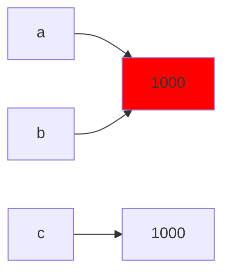

# Задание 1. От исходного кода к байткоду

# Часть 1.
### Выполнение выражения в консоли(REPL):


### Выполнение выражения в файле:


#### В REPL результат отображается автоматически, так как он автоматически считывает и выводит результат выражения в консоль. 
#### В скриптовом режиме, при запуске файла task_1.py интерпретатор последовательно выполняет команды, данные ему. Он получает выражение 2+3*4 (14), но не выводит, так как не была дана команда print.

### Измененный корректный файл:


# Часть 2.
``` python
course = "Python"
hours = 4 * 2
print(f"{course}: {hours} часов")
```
### Выражения:
#### строка: "Python"
#### числа: 4 2
#### арифметическое выражение: 4 * 2
#### переменные: course hours
#### f-строка/форматирование: f"{course}: {hours} часов"
#### вызов функции: print(f"{course}: {hours} часов")


### Инструкции:
#### присваивание: course = "Python" и hours = 4 * 2
#### вызов функции: print(f"{course}: {hours} часов")


### Литералы:
#### "Python", ": ", " часов", 4, 2


### Создаваемые имена:
#### course и hours


# Часть 3.
```
> python --version
Python 3.13.5
```

```
> python -m ast task_1.py
Module(
   body=[
      Assign(
         targets=[
            Name(id='course', ctx=Store())],
         value=Constant(value='Python')),
      Assign(
         targets=[
            Name(id='hours', ctx=Store())],
         value=BinOp(
            left=Constant(value=4),
            op=Mult(),
            right=Constant(value=2))),
      Expr(
         value=Call(
            func=Name(id='print', ctx=Load()),
            args=[
               JoinedStr(
                  values=[
                     FormattedValue(
                        value=Name(id='course', ctx=Load()),
                        conversion=-1),
                     Constant(value=': '),
                     FormattedValue(
                        value=Name(id='hours', ctx=Load()),
                        conversion=-1),
                     Constant(value=' часов')])]))])
```
### Присваивание
```
Assign(
         targets=[
            Name(id='course', ctx=Store())],
         value=Constant(value='Python')),
Assign(
         targets=[
            Name(id='hours', ctx=Store())],
```
### Арифметическая операция
```
value=BinOp(
            left=Constant(value=4),
            op=Mult(),
            right=Constant(value=2))),
```
### Вызов print
```
value=Call(
            func=Name(id='print', ctx=Load()),
```

## Дизассемблирование
```
> python -m dis task_1.py
  0           RESUME                   0

  2           LOAD_CONST               0 ('Python')
              STORE_NAME               0 (course)

  3           LOAD_CONST               1 (8)
              STORE_NAME               1 (hours)

  4           LOAD_NAME                2 (print)
              PUSH_NULL
              LOAD_NAME                0 (course)
              FORMAT_SIMPLE
              LOAD_CONST               2 (': ')
              LOAD_NAME                1 (hours)
              FORMAT_SIMPLE
              LOAD_CONST               3 (' часов')
              BUILD_STRING             4
              CALL                     1
              POP_TOP
              RETURN_CONST             4 (None)
```

### Загрузка константы 
```
  2           LOAD_CONST               0 ('Python')
```
### Вызов функции 
```
              CALL                     1
```

## Почему байткод CPython нельзя считать машинным кодом процессора?
#### Машинный код процессора выполняется напрямую физическим процессором, он считывает команы и подает электрические сигналы. 
#### Байткод выполняется виртуальной машиной CPython.


# Задание 2. Имена, объекты и сравнение
Прогноз
``` 
print("a == b:", a == b) -> True (имеют одинаковые значения)
print("a is b:", a is b) -> True (было присваивание b = a)
print("a == c:", a == c) -> True (они имеют одинаковый тип и оба равны 1000)
print("a is c:", a is c) -> False (int('1000') - новый объект в памяти, не тот же самый как 1000)
```

## 1.

### Mermaid-диагамма


## 2.
#### Равенство значений(```==```) <=> эквивалентность данных хранящихся в объектах.
#### Идентичность объектов(```is```) <=> ссылаются ли две переменные на один и тот же адрес в памяти.

## 4.
### Результат выполнения


#### Выражение ```first is second``` возвращает ```True```, так как в CPython работает интернирование строк, таким образом строки ```"py" + "thon"``` на этапе компиляции в байткод сворачиваются в единую ```"python"``` и ссылаются уже на существующий объект в памяти.

## 5.
#### ```==``` используется для сравнения значений 
#### ```is``` используется для проверки того, являются ли две переменные одним и тем же объектом в памяти 

## Контрольные вопросы.
#### 1. Нет, инструкция ```b = a``` создает новую пременную ```b``` и связывет его с тем же объектом в памяти, на который указывает и ```a```.
#### 2. ```type()``` возвращает тип/класс объекта. ```id()``` возвращает уникальный идентификатор объекта в памяти.
#### 3. ```None``` существует в единственном экземпляре в Python, и проверка ```a is None``` выполняется быстрее, точнее и защищена от переопределения оператора ```==```. Числа и строки могут содержать одинаковые значения, но находится в разных участках памяти, поэтому сравнение через ```==``` гарантированно корректно проверяет идентичность значения (что, как правило, нам и нужно в алгоритме), вне зависимости от участков памяти.

# Задание 3. Числовые типы, операции и преобразования

## Эксперимент A. ```int``` и арифметические операторы
#### ```//``` - целочисленное деление с округлением вниз, поэтому результатом всегда будет являться объект типа ```int```. 
#### ```/``` - деление, которое в результате дает вещественное число, типа ```float```, даже если одно число кратно другому будет возвращено число с плавающей точкой.

## Эксперимент B. Большие целые числа
#### В отличии от многих языков (Java, C++, C#) где числа типа ```int``` имеют 32 или 64 битную разрядность и могут переполнятся, в Python типы ```int``` обладают длинной арифметикой и их разрядность ограничена лишь объемом доступной памяти.

## Эксперимент C. ```float```
#### Числа `0.1`, `0.2` и `0.3` невозможно точно представить в виде конечной двоичной дроби, поэтому возникает погрешность округления в младших разрядах и в итоге получается, что `0.1 + 0.2 != 0.3`.
#### Для сравнения чисел типа `float`следует использовать функцию `math.isclose(a, b)`.

## Эксперимент D. bool, complex и явное преобразование типов
#### Функция `bool` проверяет строку на пустоту, любая непустая строка дает значение истина, то есть `True`, `False` будет только при пустой строке.

## Контрольные вопросы.
#### 1. Оператор `/` выполняет математическое деление, может быть такое, что одно число не кратно другому, и тогда получается дробное число.
#### 2. `int("42")` выполняет парсинг текстовой строки с представлением числа и возвращает целое число `42`
####    `int(42.9)` ввыполняет отбрасывание дробной части у вещественного числа и выводит его челую часть - `42`
#### 3. `bool(0)` и `bool("")`

# Задание 4. Строки, Unicode и форматирование

## 8. 
#### Ошибка: `TypeError: 'str' object does not support item assignment`. Причина: Строки в Python являются неизменяемыми объектами, после создания нельзя изменить ее отдельные символы.

## Контрольные вопросы.
#### 1. `len(symbol)` считает количество символов в строке, для строки "Я" это значение равно 1.
####    `len(symbol.encode("utf-8"))` считает количество байтов в кодировке этой строки в формате UTF-8, где символы кириллицы кодируются 2 байтами, поэтому значение длины байтовой строки равно 2.
#### 2. `start` — индекс элемента, с которого начинается срез (включительно).
####    `stop` — индекс элемента, на котором срез заканчивается (не включительно).
####    `step` — шаг выборки элементов.
#### 3. Методы вроде `upper()` не изменяют строку, а создают новую с примененными изменениями.

# Задание 5. Информационная карточка вычислительного эксперимента
## 1. Таблица связывания имен и типов объектов
```
| Имя переменной  | Тип связанного объекта | Описание 
| researcher      | str                    | Имя исследователя 
| experiment      | str                    | Название эксперимента
| launches_count  | int                    | Количество запусков
| launch_duration | float                  | Длительность одного запуска
| real_coef       | float                  | Действительная часть коэффициента
| imag_coef       | float                  | Мнимая часть коэффициента
| total_sec       | float                  | Общая длительность в секундах
| total_min       | float                  | Общая длительность в минутах 
| coef            | complex                | Комплексный коэффициент
| modulus_sq      | float                  | Квадрат модуля коэффициента
| has_runs        | bool                   | Флаг наличия запусков
```

## 2. Разбор арифметической строки
#### Cтрока: `modulus_sq = real_coef ** 2 + imag_coef ** 2`
#### Переменные: `modulus_sq`, `real_coef`, `imag_coef`
#### Операторы: 
#### `=` - оператор присваивания
#### `**` - оператор возведения в степень
#### `+` - оператор сложения
#### литералы: `2` (`int`)
#### вызовов функций нет

## 3. Путь программы от исходника до выполнения
#### 1. Код файла `task_5.py` хранится на диске в виде текстового файла с исходным текстом.
#### 2. Лексический и синтаксический анализаторы Python читают файл, разбивают его на лексемы и проверяют соответствие синтаксису языка.
#### 3. Создается древовидная структура данных, отражающая логику и иерархию команд.
#### 4. AST компилируется в байткод - платформонезависимые низкоуровневые инструкции виртуальной машины CPython (`.pyc`).
#### 5. Виртуальная машина CPython последовательно считывает инструкции байткода и исполняет их на физическом процессоре компьютера.

## 4. Необходимость явного преобразования `input()`
#### Функция `input()` всегда возвращает значение типа `str`, независимо от того, что ввел пользователь. Если не выполнить явное приведение типов, то попытка выполнить сложение или деление вызовет ошибку `TypeError`. Операция умножения `str * int` выполнит дублирование строки.

## Контрольный вопрос.
#### При повторном присваивании (`launches_count = 10`):
#### 1. В памяти создается новый объект со значением `10`.
#### 2. Имя `launches_count` перенаправляется на этот новый объект.
#### 3. Старый объект остаётся неизменным в памяти. Если на него больше не ссылается ни одно другое имя, он становится кандидатом на удаление сборщиком мусора.
